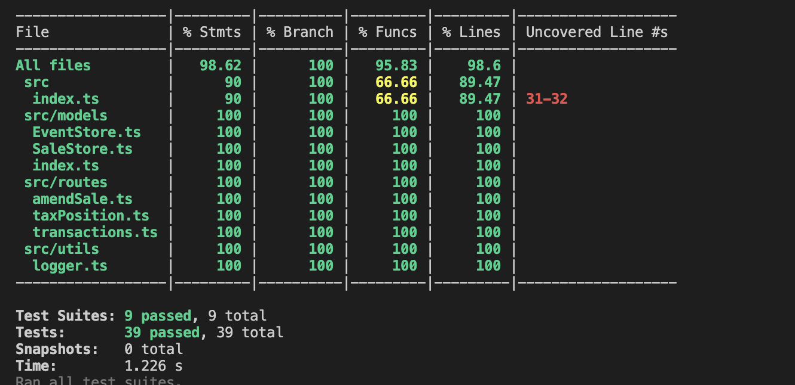

# Novabook Tax Service

## Overview

This service manages tax-related transactions for Novabook. It allows ingestion of sales and tax payment events, querying tax positions at specific dates, and amending sales records.

## Features

- **Ingest Transactions:** Accept sales and tax payment events.
- **Query Tax Position:** Calculate tax positions up to a given date.
- **Amend Sales:** Modify items within sales events.
- **Observability:** Logging of events and errors.

## Technologies

- **TypeScript**
- **Express.js**
- **ESM (ES2022)**
- **Winston** for logging
- **Jest** for coverage
- **Prettier** for code formatting
- **ESLint** for code linting and error detection
- **Vercel** for deployment

## Getting Started

### Prerequisites

- **Node.js** (v14 or later)
- **npm**

### Installation

1. **Clone the repository:**

   ```bash
   git clone <repository-url>
   cd novabook-tax-service

   ```

2. **Install dependencies:**

```bash

  npm install

```

### Running the Service

Development Mode (with auto-reloading):

```bash

  npm run dev

```

Production Mode:

1. **Build the project:**

```bash

  npm run build

```

2. **Start the server:**

```bash

  npm start

```

The server will start on port 3000 by default. You can set the PORT environment variable to change the port.

3. **Run Tests**

```bash

  npm test

```

### Code Coverage



## Testing API Endpoints

### Access Swagger UI

Navigate to http://localhost:3000/api-docs (or your configured port) to view the automatically generated documentation for your API.

### Test with bash script

1. **Ingest a Sales Event:**
   Endpoint: POST /transactions
   Description: Ingests sales events.
   Request:

```bash
    curl -X POST http://localhost:3000/transactions \
    -H "Content-Type: application/json" \
    -d '{
    "eventType": "SALES",
    "date": "2024-02-22T17:29:39Z",
    "invoiceId": "3419027d-960f-4e8f-b8b7-f7b2b4791824",
    "items": [{
        "itemId": "02db47b6-fe68-4005-a827-24c6e962f3df",
        "cost": 1099,
        "taxRate": 0.2
    }]
    }'
```

Response:
Status: 202 Accepted

2. **Injest Tax Payment Event:**
   Endpoint: POST /transactions
   Description: Ingests tax payment events.
   Request:

```bash
    curl -X POST http://localhost:3000/transactions \
    -H "Content-Type: application/json" \
    -d '{
    "eventType": "TAX_PAYMENT",
    "date": "2024-02-22T17:29:39Z",
    "amount": 74901
    }'
```

Response:
Status: 202 Accepted

3. **Query Tax Position** Amend Sale
   Endpoint: GET /tax-position
   Description: Retrieves the tax position as of a specific date.
   Query Parameter Example: GET /tax-position?date=2024-02-22T17:29:39Z
   Response:

   ```json
   {
     "date": "2024-02-22T17:29:39Z"
   }
   ```

   Status: 200 OK

4. **Amend Sale**  
   Endpoint: PATCH /sale
   Description: Amends an item within a sale.
   Request:

```bash
  curl -X PATCH http://localhost:3000/sale \
  -H "Content-Type: application/json" \
  -d '{
    "date": "2024-02-23T10:00:00Z",
    "invoiceId": "3419027d-960f-4e8f-b8b7-f7b2b4791824",
    "itemId": "02db47b6-fe68-4005-a827-24c6e962f3df",
    "cost": 798,
    "taxRate": 0.15
  }'
```

5. **Query Tax Position After Amendment:**  
   Endpoint: PATCH /sale
   Description: Amends an item within a sale.
   Request:

```bash
    curl "http://localhost:3000/tax-position?date=2024-02-23T10:00:00Z"
```

    Response:

```json
    {
        "date": "2024-02-23T10:00:00Z",
        "taxPosition": -72701 + (798 _ 0.15 - 1099 _ 0.2) = // Calculate accordingly
    }
```

-- DEPENDENCIE LIST --

Production:
express

Development:
nodemon
ts-node (tsx does not support types, ts-node-dev has issues with ESMs)

TODO in future:
Error Handling Middleware test is failing - check error handeling in index.ts
Deploy
Babel for advanced ESM support
